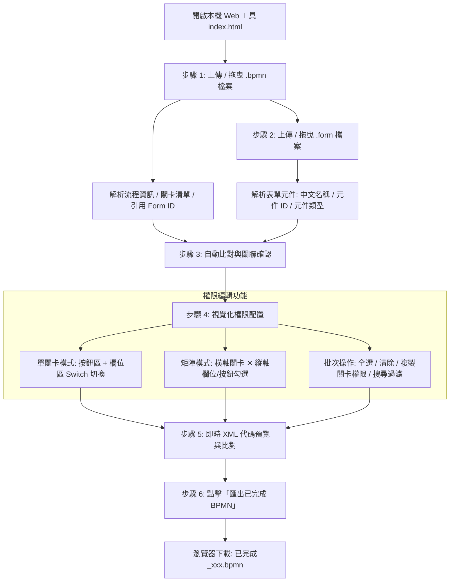

# 產品需求文件 (PRD)：鼎新 BPM 欄位與按鈕權限視覺化設定工具 (Web 本地版)

---

## 1. 執行摘要 (Executive Summary)

### 1.1 專案背景與痛點
- **XML 結構深層且繁瑣**：鼎新 BPM (DSC Nana / EasyFlow) 的欄位與按鈕存取權限定義於流程檔（`.bpmn`）的 `<activityDefinitions>` -> `<formFieldAccessDefinition>` -> `<formFieldAccessControl>`。其內容為**二次 XML 逃脫字串（Escaped XML）**，手動編寫極易發生標籤不閉合、ID 拼寫錯誤或遺漏。
- **缺乏元件中文對照**：流程檔（`.bpmn`）內僅記錄元件 ID，缺乏表單欄位的中文名稱（Label / Caption），開發人員需在 `.form` 與 `.bpmn` 之間頻繁切換對照。
- **無跨關卡權限總覽**：傳統設計器無法一次綜觀所有流程關卡的權限分佈，容易造成關卡權限遺漏或衝突。
- **環境相依性限制**：需要一個**純本機運作、無須安裝後端環境或伺服器**的輕量工具，開箱即用且確保企業表單資料安全不外流。

### 1.2 產品目標
1. **本機極簡運行 (Zero Dependency / Local SPA)**：純前端單頁應用（HTML5 + CSS3 + Vanilla JavaScript），可直接於現代瀏覽器本機開啟，資料 100% 停留於本機，安全快速。
2. **流程與表單自動連動 (Auto-linking & Parsing)**：
   - 讀取 `.bpmn` 萃取所有 UserTask / ManualTask 關卡與引用的 Form Definition ID。
   - 讀取 `.form` 萃取所有控制項與按鈕之中文名稱（配對 Label / Caption）、元件 ID 與類型。
3. **直覺雙模式設定 (Dual-view Permission Matrix)**：
   - **單一關卡模式 (Step Focus View)**：針對單一關卡進行按鈕與欄位開關切換。
   - **全關卡權限矩陣 (Full Matrix View)**：以矩陣表格呈現「欄位/按鈕 ✕ 關卡」，支援一鍵批次勾選與跨關卡複製。
4. **無損無失真回寫匯出 (Lossless BPMN Write-back)**：
   - 保留原 BPMN 的所有圖形節點（`bpmXML`）、連線（`DiagramLink`）、參與者（`ParticipantDefinition`）、BOM 與 UTF-8 編碼。
   - 正確生成/更新 `<formFieldAccessControl>` 逃脫 XML 節點，輸出 `已完成_[原檔名].bpmn`。

---

## 2. 系統架構與使用者操作流程 (Workflow)



---

## 3. 詳細功能規格 (Functional Specifications)

### 3.1 步驟一：BPMN 流程檔解析 (`.bpmn`)
1. **關卡萃取**：
   - 解析 `<processDefinitions>` -> `<activityDefinitions>` 中的所有活動節點。
   - 篩選支援權限設定的關卡類型：`UserTask`、`ManualTask` 等人工操作節點（排除 `StartEvent`、`EndEvent`、`SendTask`，但若使用者需要亦可展開檢視）。
   - 萃取欄位：`id`（關卡 ID）、`name`（關卡中文名稱）、`bpmnType`（節點類型）。
2. **表單引用關聯**：
   - 萃取 `<relevantDataDefinitions>` 內 `<dataType class="...FormType">` 之 `<formDefinitionId>`（例如 `quickDevTestFormImport`）。
   - 或自 `<Tool>` 的 `<actualParameters>` 萃取關聯表單 ID。
3. **現有權限讀取**：
   - 深入解析各關卡 `<formFieldAccessDefinition>` 下的 `<formFieldAccessControl>`。
   - 將 XML 逃脫內容（如 `&lt;FormFieldAccessControl&gt;...&lt;/FormFieldAccessControl&gt;`）反轉義並結構化為既有權限集合（ID ➔ `ENABLED`）。

---

### 3.2 步驟二：表單檔案解析 (`.form`)
1. **元件與中文標籤配對**：
   - 解析 `<elementDefinitions>` 底下所有控制項與標籤。
   - 依 `pairId` 或 `lbl_{元件ID}` 關聯 `OutputElementDefinition`（標籤）取得中文名稱 `textValue`。
   - 按鈕類別（`TriggerElementDefinition`）直接抓取 `caption` 或 `id`。
2. **元件分類與型別識別**：
   - **按鈕類 (Action Buttons)**：`TriggerElementDefinition`，或 ID 結尾為 `Button`/`Btn`。
   - **輸入控制項 (Input Fields)**：`InputElementDefinition` (TEXTBOX, TEXTAREA, PASSWORD)、`DateElementDefinition` (DATE, DATETIME)、`SelectElementDefinition` (DROPDOWN, RADIO, CHECKBOX)、`SerialNumberElementDefinition`、`GridElementDefinition` (LIST/GRID)、`AttachmentElementDefinition` 等。
3. **過濾非權限控制項**：
   - 純裝飾標籤（無 pairId 且未被引用的獨立 Label）、水平分隔線（`HorizontalLineElementDefinition`）預設隱藏或標示為不可授權。

---

### 3.3 步驟三：權限配置介面 (UI / UX 規劃)

#### (1) 關卡切換與概覽
- 頂部顯示關卡標籤列（Tabs）或關卡下拉選單，標示各關卡已授權按鈕數與欄位數（例如：`開單 [按鈕: 1, 欄位: 2]`）。
- 提供「切換矩陣視圖」按鈕，展開全流程多關卡對照表。

#### (2) 按鈕權限區塊 (Action Buttons Section)
- 獨立於上方重點展示。
- 採用卡片/徽章膠囊風格（Button Pill Cards），點擊即可切換 `ENABLED` / 未授權。
- 顯示按鈕中文名稱（如 `[匯入CP]`、`[上傳檔案]`、`[按鈕]`）與 ID（如 `TEST_Button_06`）。

#### (3) 欄位權限區塊 (Field Permissions Section)
- 支援按元件類型群組分類（文字框、日期、選單、表格等）或依表單版面順序排列。
- 每一列提供：
  - 中文名稱 (Label Name)
  - 欄位 ID (Field ID)
  - 型別標籤 (Type Badge)
  - 權限開關 (Toggle Switch / Checkbox)：開啟代表寫入 `ENABLED`，關閉代表不授予或隱藏。

#### (4) 快捷工具列 (Quick Actions)
- **搜尋欄**：輸入關鍵字即時過濾欄位名稱或 ID。
- **一鍵全選 / 一鍵清空**：快速設定當前關卡之全部按鈕或欄位。
- **關卡複製 (Copy Permissions)**：將「關卡 A」的所有權限設定一鍵套用至「關卡 B」。
- **批次勾選**：支援按類型（例如「所有文字輸入框全部啟用」）批次操作。

---

### 3.4 步驟四：BPMN 回寫與匯出規格 (Write-back Engine)

#### (1) `<formFieldAccessControl>` 結構生成規則
針對每個設定了權限的關卡，組合出標準的逃脫 XML 字串：
```xml
<formFieldAccessControl>&lt;FormFieldAccessControl&gt;&lt;{formDefinitionId}&gt;&lt;{elementId_1}&gt;ENABLED&lt;/{elementId_1}&gt;&lt;{elementId_2}&gt;ENABLED&lt;/{elementId_2}&gt;&lt;/{formDefinitionId}&gt;&lt;/FormFieldAccessControl&gt;</formFieldAccessControl>
```

#### (2) 回寫插入與替換機制
1. **若關卡已有 `<formFieldAccessControl>`**：
   - 當有權限勾選時：以新生成的逃脫字串替換原內容。
   - 當所有權限皆清空時：將 `<formFieldAccessControl>` 標籤移除或清空（符合鼎新規格）。
2. **若關卡尚無 `<formFieldAccessControl>` 但有 `<formFieldAccessDefinition>`**：
   - 精確於 `<formFieldAccessDefinition>` 標籤內部第一順位插入 `<formFieldAccessControl>...</formFieldAccessControl>`。
3. **無損保護**：
   - 流程中其他節點（如 `bpmXML` 座標、`DiagramLink` 連線、`ParticipantDefinition` 參與者、未編輯關卡）維持 100% 原始字元不變。
4. **輸出檔案命名**：
   - 自動命名為 `已完成_[原BPMN檔名].bpmn`，絕不覆蓋使用者本地原檔。

---

## 4. 前端技術與互動規格 (Frontend Tech Stack)

1. **架構模式**：純本機前端 Single Page Application (HTML5 + CSS3 + Vanilla JavaScript / ES6+)。
2. **零外部伺服器相依**：
   - 檔案讀取：瀏覽器原生 `FileReader API` / `Drag & Drop API`。
   - XML 解析：原生 `DOMParser` 與高精度 Regex 結合（保護 Java 序列化與逃脫字元）。
   - 檔案生成：`Blob` + `URL.createObjectURL` 觸發原生下載。
3. **視覺設計 (Design Aesthetics)**：
   - 採用精緻現代化深色/淺色風格（Glassmorphic Cards, 柔和陰影, 狀態標籤）。
   - 流暢微動畫（Micro-animations）與即時回饋提示（Toast alerts）。
   - 響應式佈局，支援大螢幕多欄對照檢視。

---

## 5. 驗收標準 (Acceptance Criteria)

| 驗收項目 | 驗收條件 |
| :--- | :--- |
| **檔案載入** | 拖入 `測試快速開發-欄位權限.bpmn` 與 `已完成_quickDevTestForm.form`，1 秒內完成解析並正確辨識流程名稱、關卡與所有表單欄位。 |
| **關卡與表單關聯** | 正確讀取 BPMN 引用的 `quickDevTestFormImport`，並成功對應表單內的 20+ 個欄位與按鈕。 |
| **現有權限還原** | 載入後，[開單] 關卡自動勾選 `TEST_Button_06`、`TEST_DialogInputLabel_12` 等既有權限；[主管] 關卡自動勾選 `TEST_TextBox_07`。 |
| **視覺化編輯** | 於 UI 上任意勾選/取消按鈕與欄位權限，即時於預覽區看到正確的 `<formFieldAccessControl>` XML 片段。 |
| **BPMN 匯出** | 點擊匯出後下載 `已完成_測試快速開發-欄位權限.bpmn`，匯入鼎新 BPM 設計器能夠正常開啟，且各關卡按鈕與欄位權限完全正確生效。 |
| **格式完整性** | 回寫後的 BPMN XML 結構完整無損，流程圖節點連線正常，無亂碼且無標籤錯位。 |

---

## 6. 後續擴充規劃 (Future Enhancements)
1. **權限設定範本匯入/匯出 (JSON Preset)**：支援將權限矩陣匯出為 JSON，方便多表單或多流程快速複用。
2. **差異比對視窗 (Diff Inspector)**：匯出前提供 Before vs After 權限差異比對視窗。
